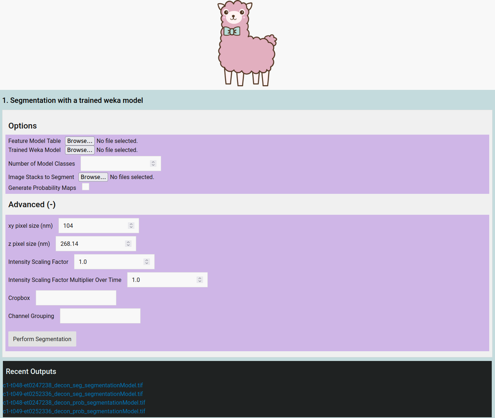

# Web Application for 4D Microscopy

### Web Verison of LLAMA (large scale light microscopy analysis with machine learning) by Doctor James Lefevre  
### Available at: https://www.ncbi.nlm.nih.gov/pmc/articles/PMC8375126/ 
### Repo: https://github.com/jameslefevre/4D-microscopy-pipeline

#### The original pipeline is incredible, but requires manual setting of arguments to scripts. This application would provide server logic to allow anyone to run LLAMA on their lattice light sheet data. It works by using Python / Flask to collect user inputs and execute them as shell arguments with the bundled Fiji (Image-J) install. Currently only handles step 1, Semantic Segmentation. User data is paertially validated on the client and server sides. 

### Requirements: 
<li> Flask </li>
<li> LLAMA (https://github.com/jameslefevre/4D-microscopy-pipeline) </li>
<li> A Specific version of Fiji () </li>

### Installation:

 Pull this repo. Remove all hidden .gitkeep files from otherwise empty directories. Download and move "Fiji.app" into the top level directory. Install flask, then run 'python3 LLAMA.py" and navigate to localhost:5000 

